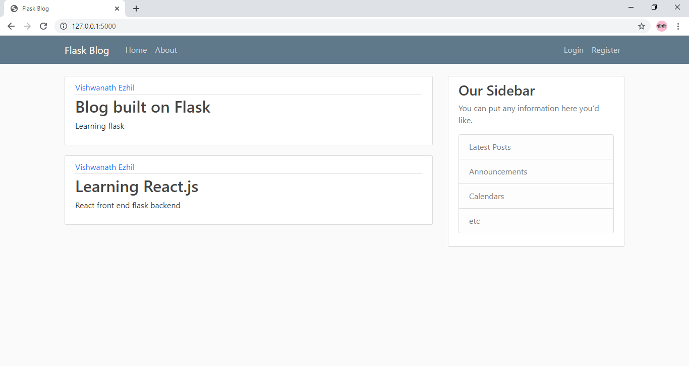
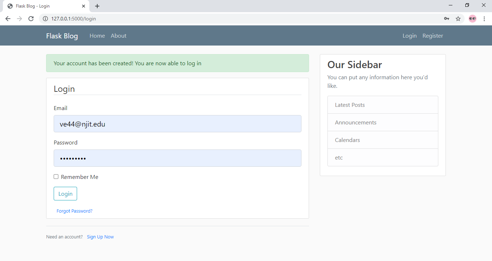
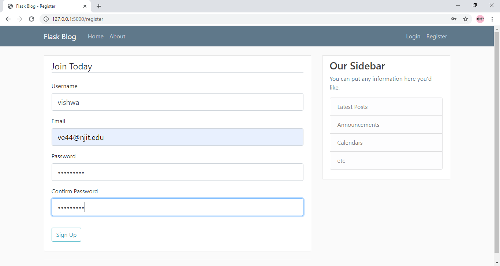
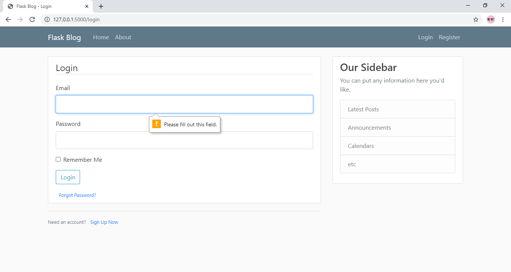
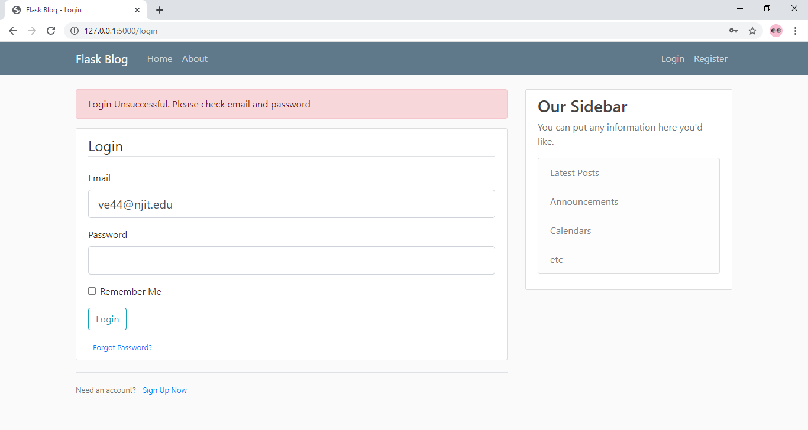

# Flask Web App: A blogging website

This is a project where I am working on building a Blogging Website. This bloggin website is built on Flask and users can create accounts, add, delete and edit posts.
The website also includes email and password authentication for users, error handling and form validation.

### Run the following commands after cloning the project to test it out yourself:

- pip install Flask
- pip install Flask-SQLAlchemy
- pip install flask-bcrypt
- pip install flask-login 
- pip install flask_wtf
- pip install Pillow 

### Project Screenshots

The above image shows the home page for the web app where users can see the posts in the website and have the options to login or register

Email and password validation

### Note: This project is still a work in progress and as I continue to work on it, I plan to improve the website and launch a live build.

Tutorial Source: https://www.youtube.com/playlist?list=PL-osiE80TeTs4UjLw5MM6OjgkjFeUxCYH
